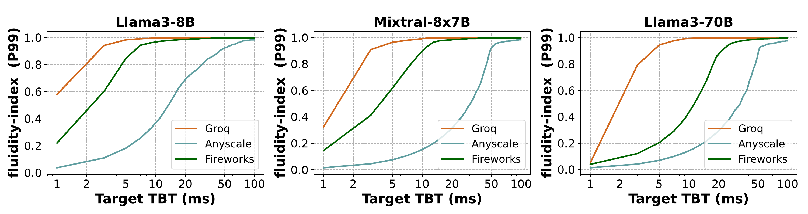

Black-box Evaluation
====================

``metron`` performs black-box evaluation of both proprietary and open-source systems.

Check out the following resources to learn how to run ``metron`` with both proprietary and open-source systems:

.. toctree::
    :maxdepth: 2
    
    public_apis
    open_source_systems

Following figures show evaluations by ``metron``:

.. _token_rate_comparison_api:

.. figure:: ../_static/assets/token_rate_comparison_api.png
    :alt: toke_rate_comparison_api
    :align: center
    
    **Token Rate Comparison**

Above figure depicts throughput measured by ``metron`` for different systems based on three different metrics:

* TPOT
* TBT
* Deadline based on *fluidity-index*

.. _tbt_cdf_api:

    
    **TBT CDF**

Above figure depicts TBT CDF for different systems. It is difficult to interpret the difference in TBT across different systems.

.. _tbt_acceptance_rate_curve:

    
    **TBT Acceptance Rate Curve**

Above figure clearly highlights the difference in TBT across different systems which was difficult to interpret in previous figure, :ref:`tbt_cdf_api`.
