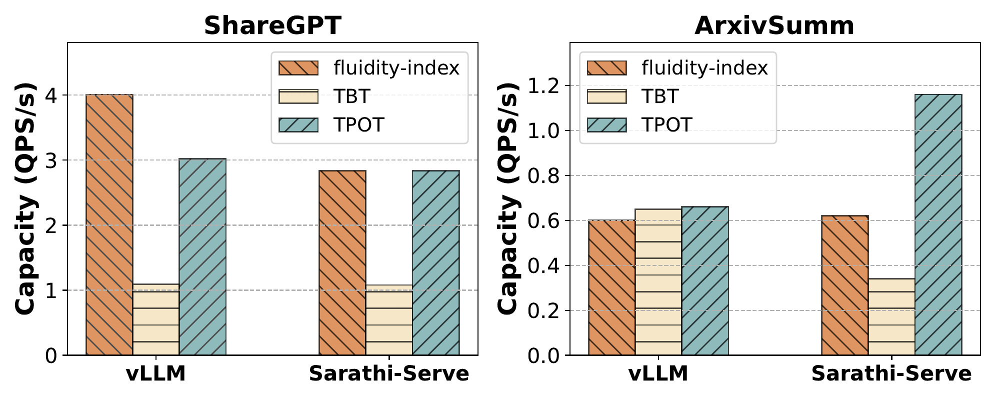

Capacity Search
===============

.. note::

    Run prefill profiler for given model and system configuration before running capacity search. To run prefill profiler, refer to :doc:`prefill_profiler`.

Capacity Search is a tool to help find maximal QPS given different SLOs. There are three types of SLOs:

1. **Fluidity-Index based:** does QPS search based on deadline slo and deadline miss rate (1 - *fluidity-index*) slo. Also leverages request-level deadline miss rate percentile.
2. **TBT based:** does QPS search based on tbt and ttft slo with their percentiles.
3. **TPOT based:** does QPS search based on ttft and tpot slo with their percentiles.

Below figure shows maximum capacity achieved for different SLOs for Llama-3-8B on different traces and open source systems on H100 GPU:

Following sections explain running capacity search for each of the above SLOs.

Fluidity-Index Based SLO
~~~~~~~~~~~~~~~~~~~~~~~~

.. code-block:: shell

    python -m etalon.capacity_search.main \
    --output-dir "cap_experiments/capacity_search/" \
    --profile-dir "prefill_experiments/prefill_profiler_vllm_llama-3-8b" \
    --slo-type deadline \
    --tbt-slo 0.03 \
    --ttft-slack-slo 0.3 \
    --deadline-miss-rate-slo 0.1 \
    --deadline-miss-rate-percentile 0.99 \
    --max-iterations 10 \
    --config-path ./etalon/capacity_search/config/llama_8b.yml

.. note::

    ``--profile-dir`` should point to where ``prefill_predictor.pkl`` model (obtained when running prefill profiler) is stored for a given model and open source system.

TBT Based SLO
~~~~~~~~~~~~~

.. code-block:: shell

    python -m etalon.capacity_search.main \
    --output-dir "cap_experiments/capacity_search/" \
    --slo-type tbt_ttft \
    --tbt-slo 0.03 \
    --tbt-percentile 0.9 \
    --ttft-slo 0.3 \
    --ttft-percentile 0.9 \
    --max-iterations 10 \
    --config-path ./etalon/capacity_search/config/llama_8b.yml

TPOT Based SLO
~~~~~~~~~~~~~~

.. code-block:: shell

    python -m etalon.capacity_search.main \
    --output-dir "cap_experiments/capacity_search/" \
    --slo-type ttft_tpot \
    --ttft-slo 0.3 \
    --ttft-percentile 0.9 \
    --tpot-slo 0.03 \
    --tpot-percentile 0.9 \
    --max-iterations 10 \
    --config-path ./etalon/capacity_search/config/llama_8b.yml

Caching
~~~~~~~

The capacity search runs for given model and open source system are cached. This means, when we run capacity search again with different SLO type and values, the benchmark runs with previously explored QPS values will be used directly instead of doing new benchmark runs.

