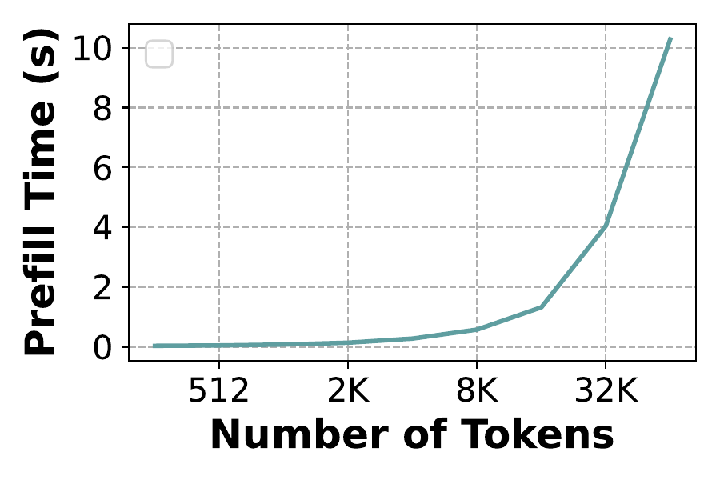

Prefill Profiler
================

To profile prefill times of open source systems and create a prefill time predictor for a given model and open source system combination, based on input prompt length, we can run ``etalon.prefill_profiler``.

Above figure shows prefill time curve for Yi-34B on 2 H100s. We can see that prefill time increases with prompt length quadratically.

Launch any open source system and setup API keys and URL as shown in :doc:`open_source_systems`.

And, then run the following command:

.. code-block:: shell

    python -m etalon.prefill_profiler \
    --model "meta-llama/Meta-Llama-3-8B-Instruct" \
    --timeout 600 \
    --fixed-request-generator-decode-tokens 16 \
    --output-dir "prefill_experiments/prefill_profiler_vllm_llama-3-8b"

Adjusting Prompt Lengths
~~~~~~~~~~~~~~~~~~~~~~~~

By default, prefill profiler profiles the following range of prompt lengths:

.. code-block:: python

    [256, 512, 1024, 2048, 4096, 8192, 16384]

To profile a custom range of prompt lengths, use the flag ``--prefill-lengths`` as follows:

.. code-block:: shell

    python -m etalon.prefill_profiler \
    --model "meta-llama/Meta-Llama-3-8B-Instruct" \
    --timeout 600 \
    --fixed-request-generator-decode-tokens 16 \
    --output-dir "prefill_experiments/prefill_profiler_vllm_llama-3-8b" \
    --prefill-lengths 256 512 1024 2048 4096 8192 16384 32768 65536

