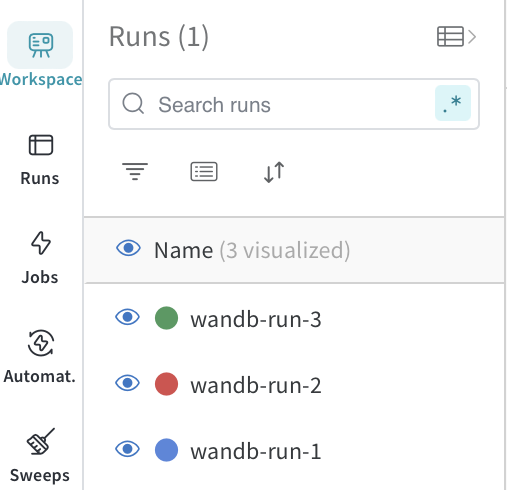

Visualizing Metrics
===================

``etalon`` logs all the metrics to wandb. You can visualize these metrics using wandb dashboard. Check :ref:`wandb_setup` to setup wandb and :ref:`wandb_args_open_source_systems` to log metrics to wandb.

To visualize the metrics, follow the steps below:

1. Go to wandb dashboard at ``https://wandb.ai/<your-org>/<your-project>``.
2. Select the runs you want to visualize in Workspace tab.

3. Go to any charts section you want to visualize.

.. image:: ../_static/assets/charts.png
    :alt: wandb_charts
    :align: center

4. Select the chart from the set of available charts in a given charts section.

.. image:: ../_static/assets/metric_chart.png
    :alt: wandb_chart
    :align: center

5. You can also customize the chart based on your requirements on wandb.
